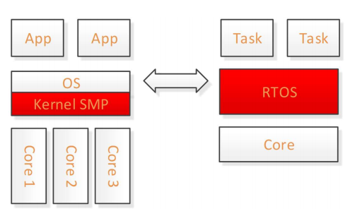
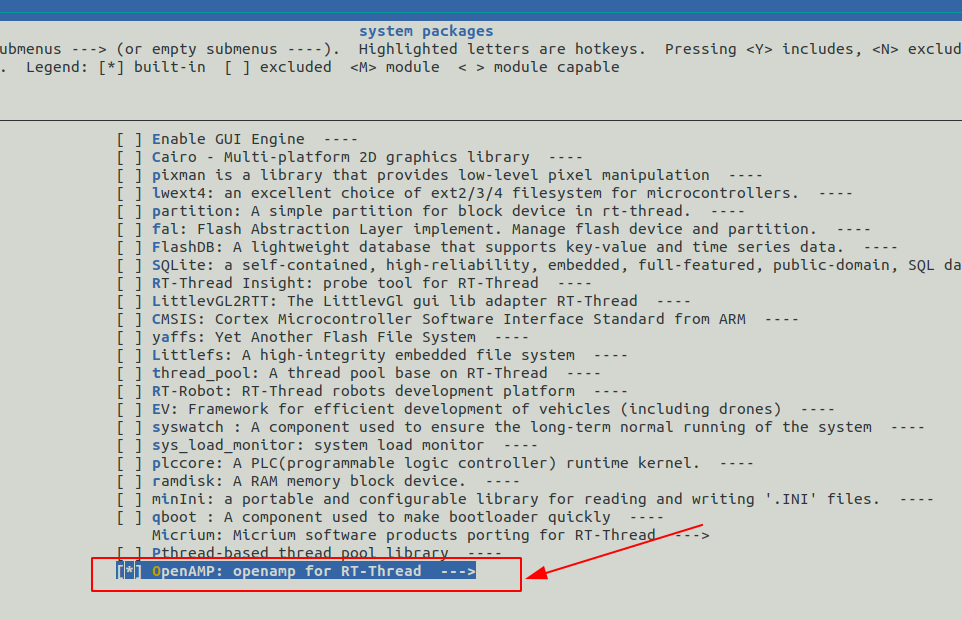
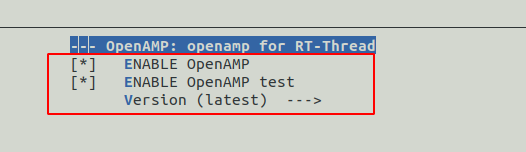

# rt-thread OpenAMP软件包使用指南

[toc]

## 1.什么是openamp

openamp(Open Asymmetric Multi-Processing)，旨在通过非对称式多处理（AMP）的开源解决方案来标准化异构嵌入式系统中操作环境之间的交互。

SoC正在变得越来越异构化，一个芯片内可能有多个处理器，而非对称的处理器则需要能够在统一芯片上并排运行不同的操作系统环境，为这些环境之间的配置和交互开发标准需要进行统一。



OpenAMP 是一个框架，提供实现AMP系统软件应用程序开发所需的软件组件。它允许操作系统在各种复杂的同构异构架构之间进行交互，并允许非对称多处理应用程序利用多核配置提供的并行性。

## 2.RT-Thread上的OpenAMP使用

对于RT-Thread上的OpenAMP，首先需要通过menuconfig开启OpenAMP。



接着选择最新版本即可。



选择后在bsp目录下输入：

```
pkgs --update
```

注意：在linux的环境下，需要输入`source ~/.env/env.sh`。

看到下面的命令表示成功。

## 3.当前软件包功能

当前已经在riscv64的qemu上运行测试。

当前已经实现的测试功能列表如下表格:

| 功能            | 测试情况 |
| --------------- | -------- |
| shmem_demod     | pass     |
| rpmsg-ping      | pass     |
| flood-ping      | pass     |
| echo            | pass     |
| matrix_multiply | pass     |

## 4.联系方式 & 感谢

- 维护：bigmagic123
- 主页：https://github.com/bigmagic123/openamp


